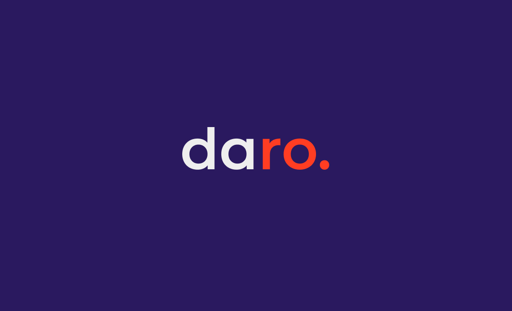

# DaRo

## About

### Group Members

* Roland Bernard, rolbernard@unibz.it
* Daniel Planötscher, dplanoetscher@unibz.it

### Project Idea

We plan to make a game that teaches people the basics of coding using a simple, self-designed
programming language. The idea is to create simple puzzles with increasing difficulty that ask the
player to solve programming-related problems, such as finding the minimum in an array, creating sums
etc.
In addition to the game, the language can also be used stand-alone using the cli interface of the
interpreter or in the purpose build IDE.

## Getting Started

### How to Test

To run all the tests for this application, execute the maven command `mvn test`. This will
automatically run all the defined test using jUnit.

### How to Build

The project can be build using the maven command `mvn package`. This will create three runnable jars
in the `target` directory:
* `target/daro-1.0.0-game.jar` when executed will launch our game
* `target/daro-1.0.0-ide.jar` when executed will launch a small IDE for programming in the DaRo
* `target/daro-1.0.0-cli.jar` when executed will launch a small REPL (Read-Eval-Print-Loop) program

### How to Run

You can run the generated jar files using the Java VM by executing for example `java -jar
target/daro-1.0.0-ide.jar` after having executed `mvn package`. If you just want to execute the
application without first packaging it, you can execute `mvn javafx:run` to execute the game and
`mvn exec:java` to execute the REPL program.

### How to Use

We split the documentation on how to use the software into four parts:
* [Language documentation](docs/language.md)
* [CLI documentation](docs/cli.md)
* [IDE documentation](docs/ide.md)
* [Game documentation](docs/game.md)

## Project video

or use: <https://drive.google.com/file/d/1iuJMGOib8d2UzXxNomz_xXO2bxto9sDh/preview>

## Implementation

### General

The implementation is split into three packages that roughly correspond to the jars generated when
executing the package goal:
* `daro.game` Includes the code for the game
* `daro.ide` Includes the code for the IDE
* `daro.lang` Includes the code for the interpreter and simple CLI program

### Libraries

For the implementation of this project we used the following third-party libraries:
* [JUnit](https://junit.org/junit5/) for the test that execute when running `mvn test`
* [JavaFX](https://openjfx.io/) to implement the graphical user interface
* [RichTextFX](https://github.com/FXMisc/RichTextFX) to as a base implementation for the code editor
* [Gson](https://github.com/google/gson) to serialize and deserialize JSON data

### Programming techniques

#### Interfaces

We use interfaces in multiple places. In the implementation of the programming language, we use the
interface `daro.lang.ast.Visitor`, that is implemented by all visitors of the AST. Other interfaces
in the interpreter are `daro.lang.interpreter.Scope` and `daro.lang.interpreter.ExecutionObserver`.

#### Abstract classes

Abstract classes are extensively used in the interpreter. For example `daro.lang.ast.AstNode` and
`daro.lang.values.DaroObject`, as well as `daro.lang.interpreter.AbstractScope` are abstract
classes. While there are a lot more abstract classes, these are the most important. Yet, also the game
makes use of abstract classes. They are mainly used to define a general, but not complete `daro.game.ui.fields` 
input field but also `daro.game.page.Page` and `daro.game.view.View` use abstract classes to define a general
template for other pages/views.

#### Generics

Generics are sparsely used in our program. The `daro.lang.ast.Visitor` interface is one example of a
generic interface used in the program. An example for a generic method can be found in
`daro.lang.interpreter.NativeScope.findClosestMatch()`. Generics are also used to define the saved type
of the `daro.game.ui.fields.SelectField`.

#### Collections

Collections are used in many places in our application. Just one of the examples is inside
`daro.lang.interpreter.NativeScope`. This class uses Maps and List.

#### Custom exceptions

We use custom exceptions for errors during parsing and execution of programs using the DaRo
interpreter. The implementation of the exception can be found in
`daro.lang.interpreter.DaroException`. Two subclasses of this exception exist,
`daro.lang.interpreter.ParsingException` and `daro.lang.interpreter.InterpreterException`.

#### Exception handling

Exception handling is a important part of the interpreter. In
`daro.lang.interpreter.Executor.execute()` for example we catch all exceptions and handle them based
on their type.

#### Method overriding

Method overriding is used in multiple locations. For example most classes in `daro.lang.values.`
override the default `equals()`, `hashCode()` and `toString()` methods.

#### Method overloading

Also method overloading is used in multiple occupations.
`daro.lang.interpreter.Interpreter.execute()` is an example of an overloaded method.

#### Lambdas

Lambdas are used in many locations. An example in the interpreter can be found in
`daro.lang.interpreter.RootScope.buildRootVariables()`. In the JavaFX applications lambdas are also
used in multiple locations for event handlers.

#### Streams

Streams are used in our application mainly for short operations like filter or map. An relatively
extensive example can be found in `daro.lang.interpreter.NativePackageScope.getCompleteMapping()`. In the
game streams are mainly used to map a list of e.g. ValidationResults to its UI components. Also, the `daro.game.validation`
validations and its results are evaluated/run using streams.

#### File I/O

File I/O is used by the programming language, the game and the IDE. For example the programming
language uses file i/o using `java.nio` in `daro.lang.interpreter.Executor.executeFileInScope()`.
In the game it is mainly used to enable persistence of user state, their settings and to save challenges,
import them into the game and to maintain playgrounds. 

#### Serialization

Serialization is used in the game to save user and level data. An example of this can be found in
`daro.game.io.UserData.writeLevelData()`.

#### Deserialization

Serialization is used in the game to read user and level data. An example of this can be found in
`daro.game.io.LevelHandler.getAllLevels()`.

#### Regular expressions

While regular expressions are not used for parsing the actual language, they are used in the code
editor for syntax highlighting. This can be seen in `daro.ide.editor.CodeEditor`. Also, it is used to
check user input within the game, for example to check the name of playgrounds.

#### Thread signaling

We used a basic amount of thread signaling in the implementation of the debugger in
`daro.ide.debug.Debugger`.

## Experience

### Organization

Given that our team consists only of two people, we organized mainly using direct communication. We
divided tasks between us and discussed what still has to be done in more or less regular intervals.

### Git usage

We split the development into multiple branches, that have then been merged incrementally into the
master branch. For example, we have made a branch for the implementation of the game, and another
ones for the implementation of the interpreter and the IDE.

### Main challenges

We did not face many challenges during the implementation of the program. Most problems were
connected with JavaFX not always behaving as one would expect. Especially, the CSS styling for
JavaFX was particularly counterintuitive. Another minor hurtle was that some tests behaved
differently on Linux and Windows, either because of the different path formats or different line
endings. 

