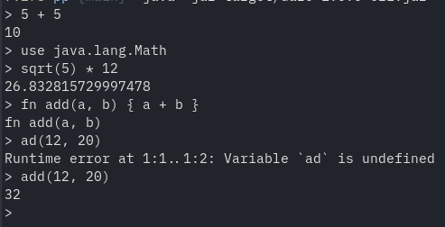

# DaRo CLI

## Usage

The CLI application can be used in two distinct ways.

If no arguments are given to the program, it will start the REPL (Read-Eval-Print-Loop). In this
mode the user is asked to input an expression.  After an expression has been entered, it will be
parsed and executed. After successful execution the result value of the expression will be printed.
If an error occurs it will be printed and the user is asked to enter another expression.

If one ore more argument is given, these arguments are interpreted as file paths. The CLI program
will execute each of the given files one after the other with the same execution context. This means
the later files retain the variables and loaded modules of the previously executed file.

