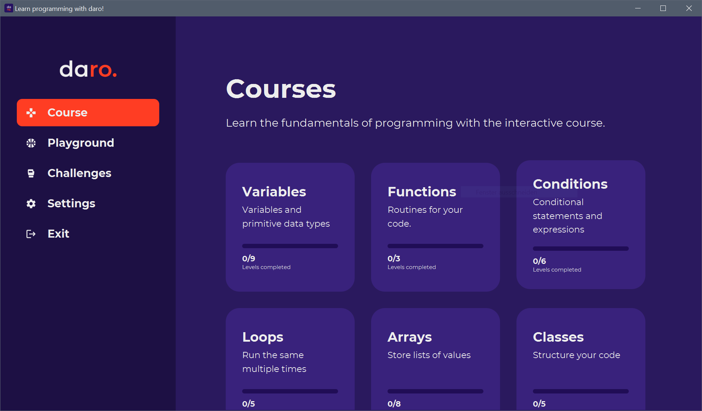

# DaRo Game

This section will talk about the game of the project. Run the game by typing `mvn javafx:run` in the terminal or by
running the packaged version after running `mvn package`

## Purpose

The purpose of the game is to teach the 'DaRo' programming language to beginners and amateurs of programming. In
addition to that, it can be used to play around with the language and to challenge other people by creating your own
levels, so-called challenges, which can be sent to others and imported directly in the game.

## Usage

The 'DaRo Game' can be categorized into four different parts

### 1. Course

The course is has the use of teaching newbies and pros the language. Since the language beginner-friendly, yet close to
other mainstream languages, this course can even be used to get in touch with programming and learn its basics. The
course is interactive and displays simple exercises, that are automatically evaluated when submitting.

#### Overview sections

The course is split into different sections, so-called 'groups of levels, or LevelGroups', which usually teach a
specific feature of programming and how it is done in the DaRo language. When clicking on one of these group of levels,
the different levels will be listed, and you can choose which exercise you want to solve.

#### Level section

Once you have clicked on one level, the scene will change to a different View, where you can solve the exercise. On the
left side a sidebar is shown that gives you basic information about the exercise and its description, as well as a
terminal, in which you can run your code (by using e.g. `print("test")` or `println("test")`
you can write into the terminal) and use it as a tool to debug your code. In the bottom-left corner, the Level View
provides you with two buttons, one is to run the current code in the terminal, and the other one is to submit the code
for testing. The rest of the screen is filled with a CodeEditor, that by default supports auto-completion,
syntax-highlighting and auto-indentation, to ensure a good user experience. Once you finished coding and believe that
your code should run how expected. You can submit it for testing, where the code is tested using pre-defined Unit Tests.
If your code does not pass all the tests, don't worry and just try again, otherwise the game gives you the possibility
to move on to the next level.

### 2. Playground

The playground can be used to, as the name suggests, play around with the programming language. By clicking on the box
containing the + sign, you can create a playground file by giving it a name. However, the name can only contain letters,
numbers and '_'. Once created a playground, you can write code and use the terminal, very similarly as in the level
view. By clicking 'Save & close' you can return to the overview page and either create a new playground, work on a
different one or navigate to other parts of the game.

### 3. Challenges

The challenges have the purpose to create you own levels and challenge your friends and colleagues with them. This page
allows you to either create a new challenge, which can be saved on your system in the form of a json file and sent to
others or to import such a json file into the game and solve the exercise.

#### Create a challenge

When clicking on '+ Create a new challenge', the view will show a large form that gives you the possibility to create a
completely custom level. Once you have filled in the basic information such as your name for the creator field (which
will be shown to the user on the overview page of the challenges), the name of the exercise and a brief description of
the task, you have to create at least one test to check the code of your colleagues. For that you have to add a source,
which is a DaRo expression, for example a variable name or a function call (if you want to check a function, which is
recommended), a validation type and if needed an expected value. The expected value is only needed if the validation
type has to compare the expression to a value.
<br>
For example, your challenge says to create a function `sum(a, b)` that adds two numbers.<br>
Here your tests may be:<br>
Source: sum(2, 5), Type: 'is equal to', expected value: 7<br><br>
Note:

* If your expected value is a string, use `"string"`.
* If your expected value is an array, you can use e.g. `[1, 3, 4]`
* The expected value is usually interpreted by the DaRo interpreter, so you can even write a whole program here.
  
This view also allows you to give the user default code, this is usually used to show them the function notation,
in the example above this may be 
```
fn sum(a, b) { 
  //here comes your code
}
```
When you want to save this level, you have to choose a directory to save it in.

#### Import and solve a challenge
If your friend sent you a challenge, you can directly import it when clicking on 'import a challenge'.
After importing it, it will be listed on the 'Challenges'-page. Once you have clicked on it, it will
open a view, which is very similar to the Level View. Here you write your code, run it and submit it for testing.

### 4. Settings
As the name suggests, this page is used to define some general settings, mostly for the Editor, e.g. if
you prefer with or without auto-indentation and auto-completion, but you can also change the theme of the
code editor.
 


