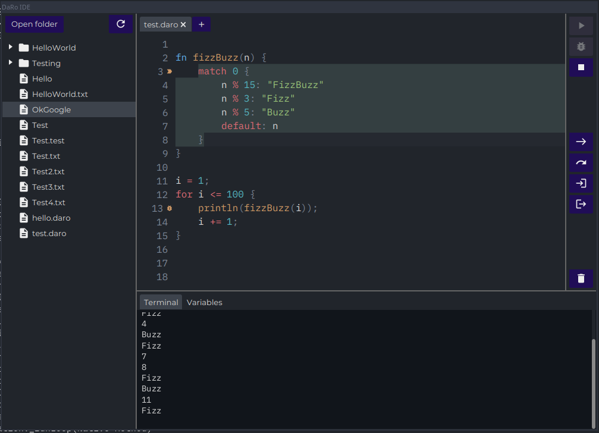

# DaRo IDE

## General

The IDE is divided into multiple parts. On the left side you will find a file browser. On the right
side there is the editor and the execution palette on the top, and the terminal and variable
inspector at the bottom.

## Files

You can use the "Open folder"-button to open a new folder. Using the button on the right you can
reload the file tree with the newest information in the file system.

To navigate the file tree simply double click on a folder to expand or collapse it. Double clicking
on a file will open it in the editor. Files and folders can also be opened from the context menu
that opens with the right mouse click. The context menu further contains commands to create new
files or folders. Files can also be renamed or deleted from the context menu.

## Editor

If you open a file in the file browser it will open up in the editor. If the extension of the file
is `.daro` this will automatically apply syntax highlighting to the content of the editor. If you
wan to open a new unnamed editor tab, use the "+"-button to the left of the already open tabs. To
save a file you can use the CTRL+S shortcut or use the context menu that opens when using the
right mouse click.

The Editor will also be used to highlight error position, should an error be thrown during execution
of a daro program. In addition to this, The debugger will show its current position when breaking
execution.

To set a breakpoint in the editor, simply double click on the line number of the line you want to
apply the breakpoint on. These breakpoints will be used by the debugger.

## Terminal

The terminal in the IDE is on the bottom right under the "Terminal"-tab. Text that is printed inside
a DaRo program using the build-in `print` or `println` methods will be printed onto this terminal. I
addition error messages from the compiler or interpreter will also be shown in this terminal window.
Furthermore, the IDE also prints some status messages on the console.

Errors will be printed in red font color, while info messages will be printed in a blue color. All
other normal prints from the program will be in the default text colour.

## Variables

The "Variables"-tab on the bottom right shows a tree of all variables in the current scope. After
successful execution of a DaRo program this will include all the variables that were put into the
root scope.

This tab is also used during debugging to show the scope variables at the location the debugger
halted at.

## Execution

The execution palette can be found at top of the right edge. The first button from the top in this
palette will execute the program in the file that is currently open in the editor. The second button
will debug the program. This means that breakpoints set in the editor will actually halt the
program. This is not the case for normal execution. To stop execution use the third button from the
top, which will interrupt the execution thread.

To clear the variables in the interpreter, the terminal and all shown errors, simply click the
button at the very bottom of the execution palette.

## Debugger

The IDE includes a build-in debugger. As stated above, the code can be debugged by using the debug
button in the execution palette. When debugging the debugger will break at all lines that have a
breakpoint set. Currently this means that execution will not halt if the line contains no
statements.

After the debugger breaks at a breakpoint, the buttons in the center will be enabled. They can be
used to, in this order from top to bottom, continue execution, step to the next node, step over to
the next line, step into the next line, step out of the currently executed function.

The debugger will also break if an exception is thrown or the thread is interrupted. In this case
all of the continuation buttons will stop any further execution of the program and show the error in
the editor.

Whenever the debugger halts, the debuggers position will be marked in the editor by selecting the
position of the currently executed part of the code. In addition a small icon will show up next to
the line number the debugger is currently at. If the file the debugger is in is not currently open
in the editor, the editor will open it.

In addition to showing the debugger position in the editor, the surrounding scope of the position
will be shown in the "Variables"-tab on the bottom right. In this tab all variables that are visible
to the current position, together with their values will be visible.

